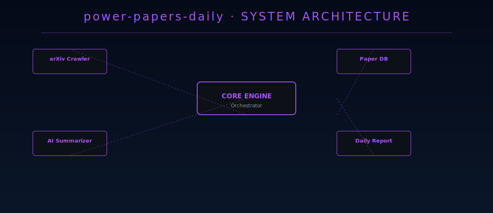

<div align="center">



</div>

## AI Literature Radar for Power Systems

[](https://developer.mozilla.org/docs/Web/JavaScript)
[](https://nodejs.org/)
[](LICENSE)
[](https://github.com/disdorqin/power-papers-daily/stargazers)
[](https://github.com/disdorqin/power-papers-daily)
[](https://github.com/disdorqin/power-papers-daily)

---

> An AI-powered daily literature mining system for power systems and energy forecasting research. Automatically fetches, scores, and summarizes the latest papers from arXiv and other sources — delivering a daily research brief to your inbox or dashboard.

## Why This Exists

Keeping up with the energy systems literature is a full-time job. This tool automates it: every day, it scans for new papers in electricity forecasting, microgrids, and energy optimization — then uses AI to extract the key findings.

## Features

- **Daily arXiv Crawling** — automated fetch of latest preprints in power systems  
- **AI-Powered Summarization** — LLM-generated summaries of key contributions  
- **Relevance Scoring** — papers ranked by relevance to your research focus  
- **Web Dashboard** — browse daily papers with an interactive UI  
- **WeChat / Email Push** — daily digest delivered automatically  
- **SOTA Tracking** — track state-of-the-art results over time  

## Architecture

<div align="center">
  
</div>

## Quick Start

```bash
# Clone and install
git clone https://github.com/disdorqin/power-papers-daily.git
cd power-papers-daily
npm install

# Configure your research interests
cp .env.example .env
# Edit .env with your API keys and preferences

# Run the daily fetch
npm start

# Or set up auto-run with GitHub Actions (already configured)
```

## Example Output

See the [live dashboard](https://disdorqin.github.io/power-papers-daily) for today's papers.

Papers are scored on:
- **Time relevance** (how recent)
- **Journal impact** (where published)
- **Citation velocity** (how fast it's being cited)
- **Topic alignment** (match with your research)

## Roadmap

- [x] Daily arXiv ingestion
- [x] AI summary generation
- [x] Web dashboard
- [ ] Integration with DARIS for automated literature review
- [ ] Multi-source aggregation (IEEE Xplore, ScienceDirect)
- [ ] Personalized recommendation engine

## Tech Stack

JavaScript · Node.js · Python · OpenAlex API · LLM APIs · HTML/CSS

## Star History

[](https://star-history.com/#disdorqin/power-papers-daily&Date)

## Contributing

See [CONTRIBUTING.md](CONTRIBUTING.md).

## License

MIT — see [LICENSE](LICENSE).
